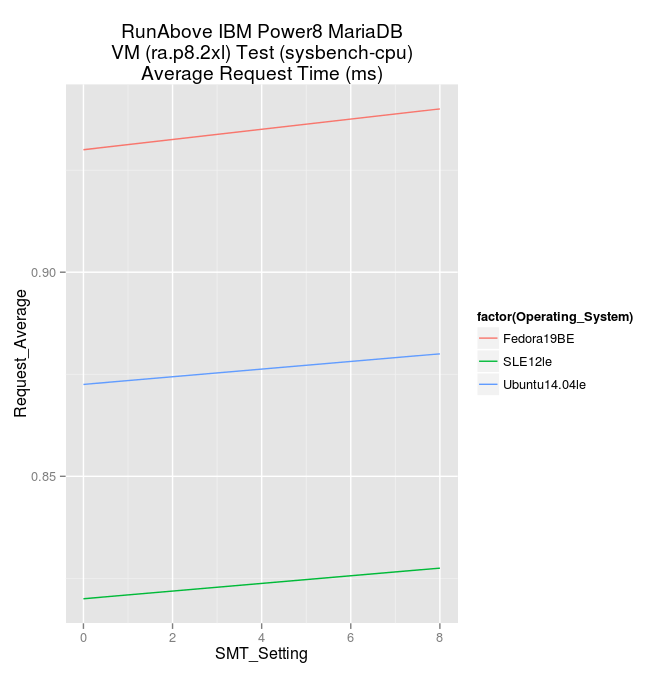
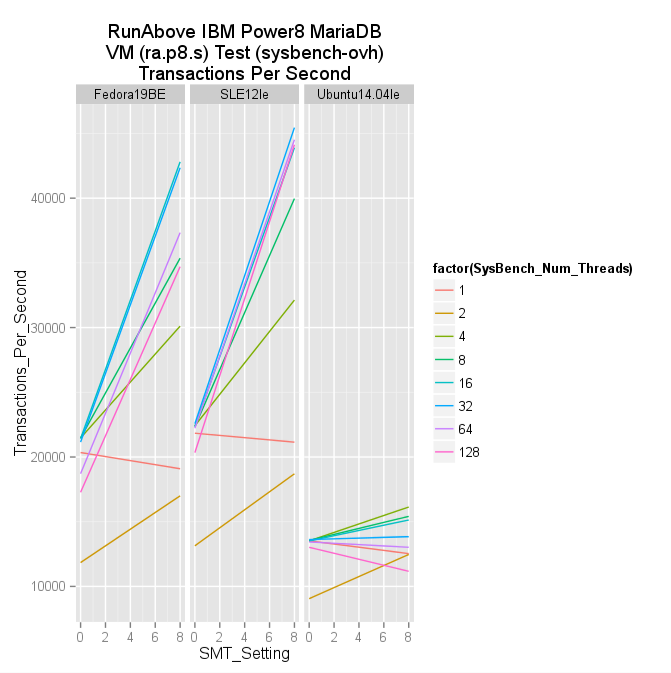
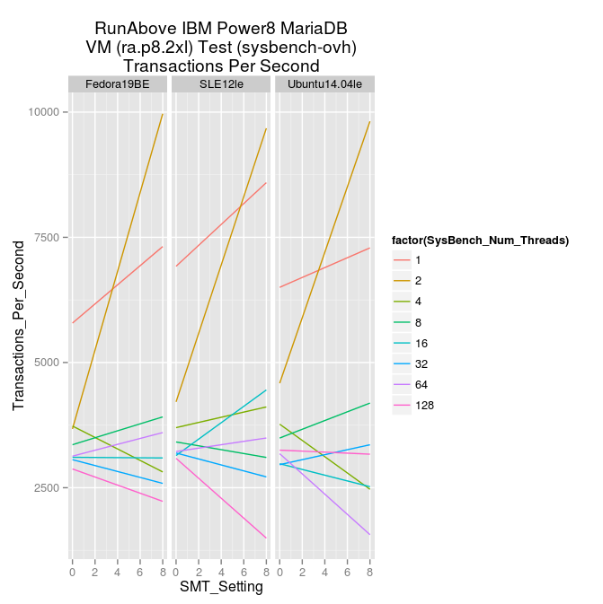
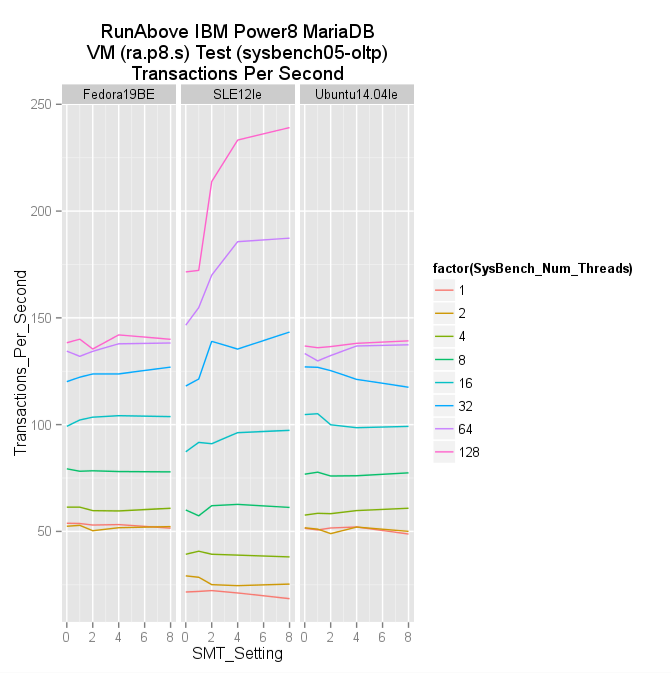
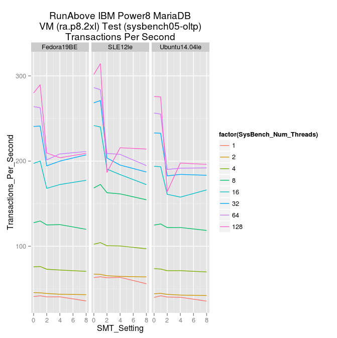

ovh-power8-mariadb-benchmarking
===============================

# Background

This project documents how a comparitive benchmarking study was done to assess MariaDB performance with Linux operating systems on Power8 architectures in a public cloud setting. Specifically the following combinations were considered:

| Attribute | Value |
| :--------- |:----- |
| Cloud Service Provider | [OVH Runabove](https://www.runabove.com/index.xml) |
| System Architecture | [IBM Power8](http://www-03.ibm.com/systems/power/software/linux/) with PowerKVM 2.1.0 |
| VM Flavor(s) | ra.p8.s ( 8VCPU, 4GB RAM, 10GB Disk ) |
|              | ra.p8.2xl ( 176VCPU, 48GB RAM, 480GB Disk ) |
| Operating System(s) | [Fedora](http://fedoraproject.org/) 19 *(BigEndian)* |
|                     | [SUSE Linux Enterprise Server](https://www.suse.com/products/server/) 12 *(LittleEndian)* |
|                     | [Ubuntu](http://www.ubuntu.com/server) 14.04 *(LittleEndian)* |
| Database | [MariaDB](https://mariadb.org/) |
| Benchmark Tool | [SysBench](https://launchpad.net/sysbench) |

The goal is to compare performance across the following variables/settings:

* Power8 Simultaneous Multi-Threading : On(8), 4, 2, 1 Off
* SysBench parallel number of threads : 1 2 4 8 16 32 64 128
* Notes:
	* where possible, utilize in-distro components, updated to the latest packages provided
	* perform no patching nor configuration/tuning of database or benchmarking components

# Process

The process for setup, configuration, data collection and analysis was as follows:

* Setup
	* obtain account with CSP with access to desired VM flavors
	* upload any operating systems images not already available
	* launch each instance combination (operating system + VM flavor)
	* login to each instance, then
		* install mariadb packages from distribution (or for larger VM flavor, due to required patches, from upstream source and compile)
		* install any needed mysql library packages from distribution
		* install sysbench packages from distribution (or find equivalent version and compile from source, as needed), yielding the resulting combinations:

| Operating System | MariaDB version | SysBench version(s)|
| ---------------- | --------------- | ------------------ |
| Fedora 19 | 5.5.38(s),10.0.14(2xl) | 0.4.12, 0.5-128 |
| SUSE Linux Enterprise Server 12 | 10.0.1(s),10.0.14(2xl) | 0.4.12.5, 0.5-128 |
| Ubuntu 14.04 | 5.5.39(s),10.0.14(2xl) | 0.4.12, 0.5-128 |

* Configuration
	* secure MariaDB installation with known username and password
		* place these values in "[.mariadbrc](./scripts/.mariadbrc)" file to be sourced by the scripts
	* ensure that MariaDB can run in safe mode (with no networking access)

* Data Collection
	* use [scripts](./scripts) to standardize testings, and produce output to known file names
		1. perform a simple CPU benchmark, see [sysbench-cpu.sh](./scripts/sysbench-cpu.sh)
		2. prepare a target database, see [sysbench-prepare.sh](./scripts/sysbench-prepare.sh), then perform an initial database benchmark, see [sysbench-ovh.sh](./scripts/sysbench-ovh.sh)
		3. perform a matrix of mixed used database benchmark, see [sysbench05-oltp.sh](./scripts/sysbench05-oltp.sh), includes another database preparation

* Data Value Extraction
	* collect the resulting run-time files from the VMs to another host for processing (samples in [data](./data))
		* Note the structure of the data files, including directory names, since the following extraction and analysis scripts derive values from those descriptive names
	* in each of these OperatingSystem-VMFlavor directories use the respective shell [scripts](./scripts) to read the collected data and summarize desired results into simple CSV files. Note - samples of these CSV output files can be found in the [data](./data) file bundles
		1. [extract-cpu.sh](./scripts/extract-cpu.sh)
		2. [extract-ovh.sh](./scripts/extract-ovh.sh)
		3. [extract05-oltp.sh](./scripts/extract05-oltp.sh)

* Analysis (or roll your own based upon the CSV or raw data files)
	* use the respective [R](http://www.r-project.org/) [scripts](./scripts) to read the CSV [data](./data) files, and generate graphs of the [results](./results)
		1. [analyze-cpu.R](./scripts/analyze-cpu.R) - lower = better
			* 
			* 
		2. [analyze-ovh.R](./scripts/analyze-ovh.R) - higher = better
			* 
			* 
		3. [analyze05-oltp.R](./scripts/analyze05-oltp.R) - higher = better
			* 
			* 
